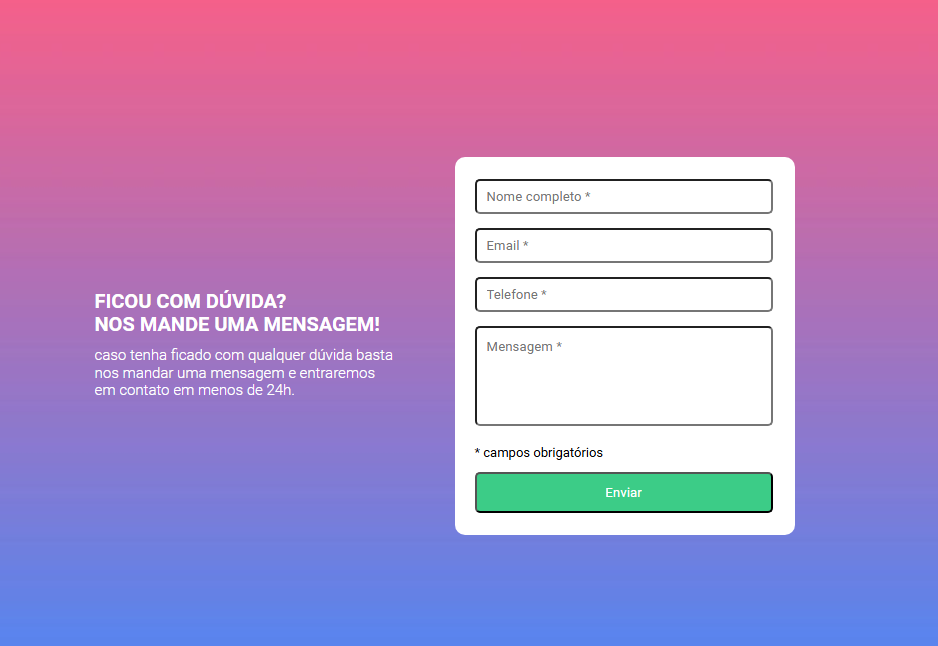
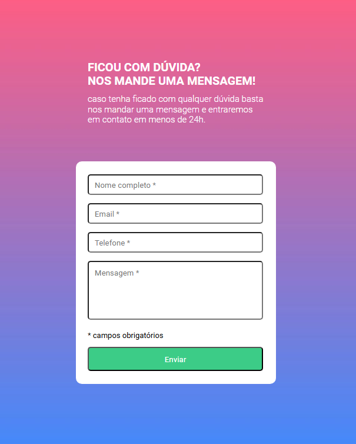
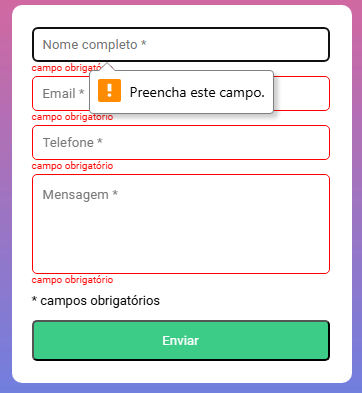
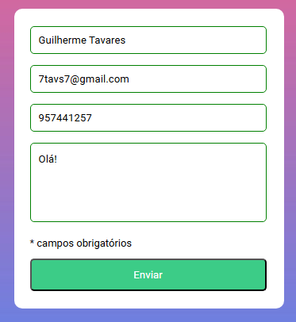
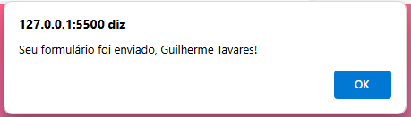

# Formulário com Validação 

## Descrição

Projeto criado para fixação de conceitos aprendidos no módulo intermediário de JS do Dev Quest - FrontEnd!

## Conceitos trabalhados e fixados no projeto:

* Estrutura de pastas padrão no projeto; ✅
* HTML Semântico; ✅
* Display Flex; ✅
* Responsividade; ✅
* Aplicação de imagens de fundo; ✅
* Validação de formulário via JS; ✅
* Uso de funções; DOM e eventos no JS ✅

## Design Desktop

    

## Design Mobile

    

## Campos Vazios

Para qualquer campo vazio do formulário, a borda do input fica vermelha e uma mensagem "campo obrigatório" em vermelho aparece!

    

## Campos Preenchidos

Para qualquer campo preenchido do formulário, a borda do input fica verde!

    

## Mensagem de alerta

Quando todos campos estiverem preenchidos e se clicar no botão "enviar", uma mensagem de alerta com o nome do usuário aparece!

    

